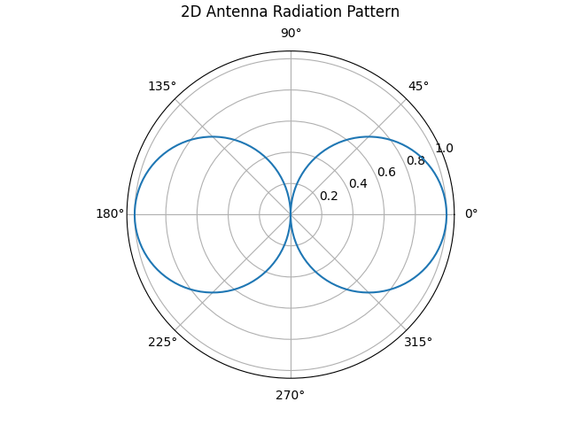
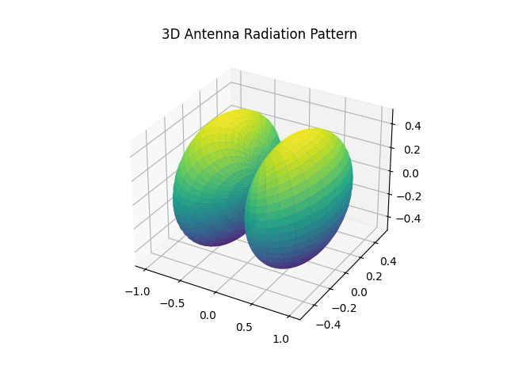
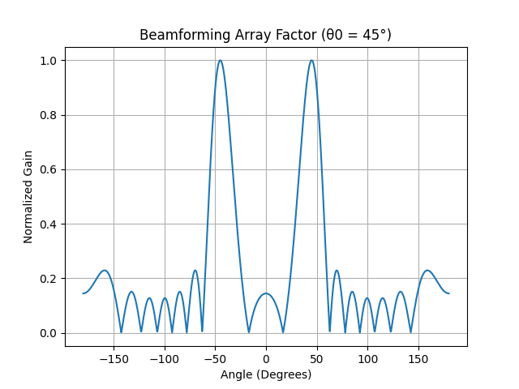

# Antenna Radiation Pattern & Beamforming Visualization

This project visualizes fundamental concepts in antenna theory using Python.

## Visualizations

1. 📡 **2D Polar Radiation Pattern** – Directional plot using a cosine function  
2. 🌐 **3D Radiation Pattern** – Simulates a basic antenna gain pattern  
3. 📶 **Beamforming Visualization** – Shows how a directional beam is formed using an antenna array

All generated plots are saved in the `plots/` folder and shown below:

### 1. 2D Polar Radiation Pattern


### 2. 3D Radiation Pattern


### 3. Beamforming Visualization


---

## Run the Code

```bash
git clone https://github.com/karthikks26/Antenna-Visualization-Bixbi.git
cd Antenna-Visualization-Bixbi
pip install -r requirements.txt
python main.py
